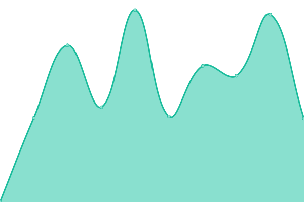
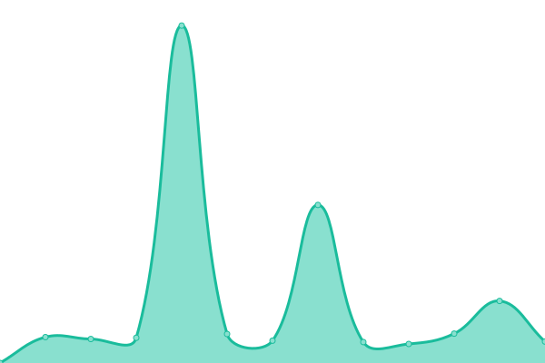

# [📈 Live Status](https://nurzhanmarket.github.io/upptime): <!--live status--> **🟧 Partial outage**

This repository contains the open-source uptime monitor and status page for [nurzhanmarket](https://nurzhanmarket.github.io/upptime), powered by [Upptime](https://github.com/upptime/upptime).

With [Upptime](https://upptime.js.org), you can get your own unlimited and free uptime monitor and status page, powered entirely by a GitHub repository. We use [Issues](https://github.com/nurzhanmarket/upptime/issues) as incident reports, [Actions](https://github.com/nurzhanmarket/upptime/actions) as uptime monitors, and [Pages](https://nurzhanmarket.github.io/upptime) for the status page.

<!--start: status pages-->
<!-- This summary is generated by Upptime (https://github.com/upptime/upptime) -->
<!-- Do not edit this manually, your changes will be overwritten -->
<!-- prettier-ignore -->
| URL | Status | History | Response Time | Uptime |
| --- | ------ | ------- | ------------- | ------ |
|  Main Page | 🟥 Down | [main-page.yml](https://github.com/nurzhanmarket/upptime/commits/HEAD/history/main-page.yml) | 

 8165ms
     
 | 

<a href="https://nurzhanmarket.github.io/upptime/history/main-page">99.53%</a>
    

|  Product Page (Apple iPhone 15 Pro 128gb Natural Titanium) | 🟥 Down | [product-page-apple-i-phone-15-pro-128gb-natural-titanium.yml](https://github.com/nurzhanmarket/upptime/commits/HEAD/history/product-page-apple-i-phone-15-pro-128gb-natural-titanium.yml) | 

 3817ms
     
 | 

<a href="https://nurzhanmarket.github.io/upptime/history/product-page-apple-i-phone-15-pro-128gb-natural-titanium">100.00%</a>
    

|  3rd level Category Page (Smartphones) | 🟩 Up | [3rd-level-category-page-smartphones.yml](https://github.com/nurzhanmarket/upptime/commits/HEAD/history/3rd-level-category-page-smartphones.yml) | 

 2419ms
     
 | 

<a href="https://nurzhanmarket.github.io/upptime/history/3rd-level-category-page-smartphones">99.77%</a>
    

|  Admin Page | 🟥 Down | [admin-page.yml](https://github.com/nurzhanmarket/upptime/commits/HEAD/history/admin-page.yml) | 

 9293ms
     
 | 

<a href="https://nurzhanmarket.github.io/upptime/history/admin-page">99.63%</a>
    

|  [test google 404](https://www.google.com/) | 🟩 Up | [test-google-404.yml](https://github.com/nurzhanmarket/upptime/commits/HEAD/history/test-google-404.yml) | 

 115ms
     
 | 

<a href="https://nurzhanmarket.github.io/upptime/history/test-google-404">100.00%</a>
    

<!--end: status pages-->

[**Visit our status website →**](https://nurzhanmarket.github.io/upptime)

## 📄 License

- Powered by: [Upptime](https://github.com/upptime/upptime)
- Code: [MIT](./LICENSE) © [nurzhanmarket](https://nurzhanmarket.github.io/upptime)
- Data in the `./history` directory: [Open Database License](https://opendatacommons.org/licenses/odbl/1-0/)
